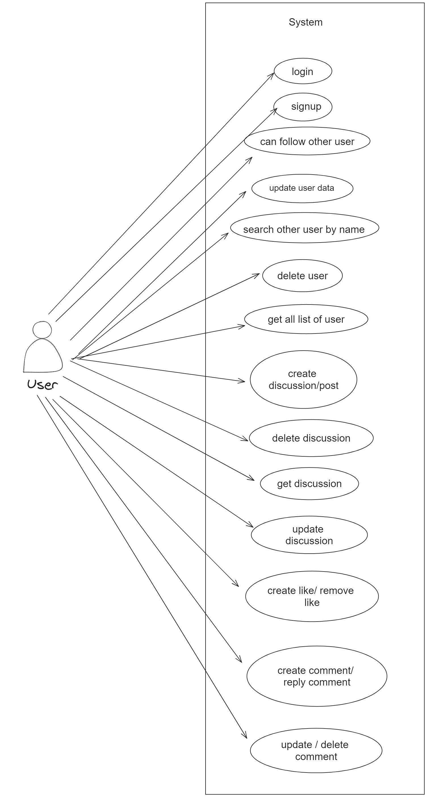
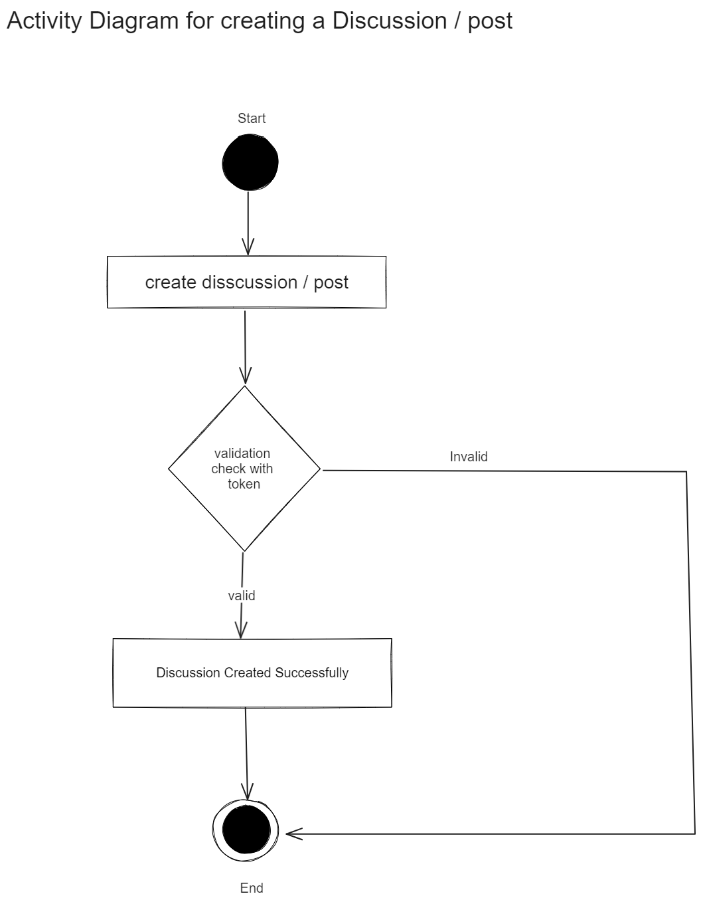
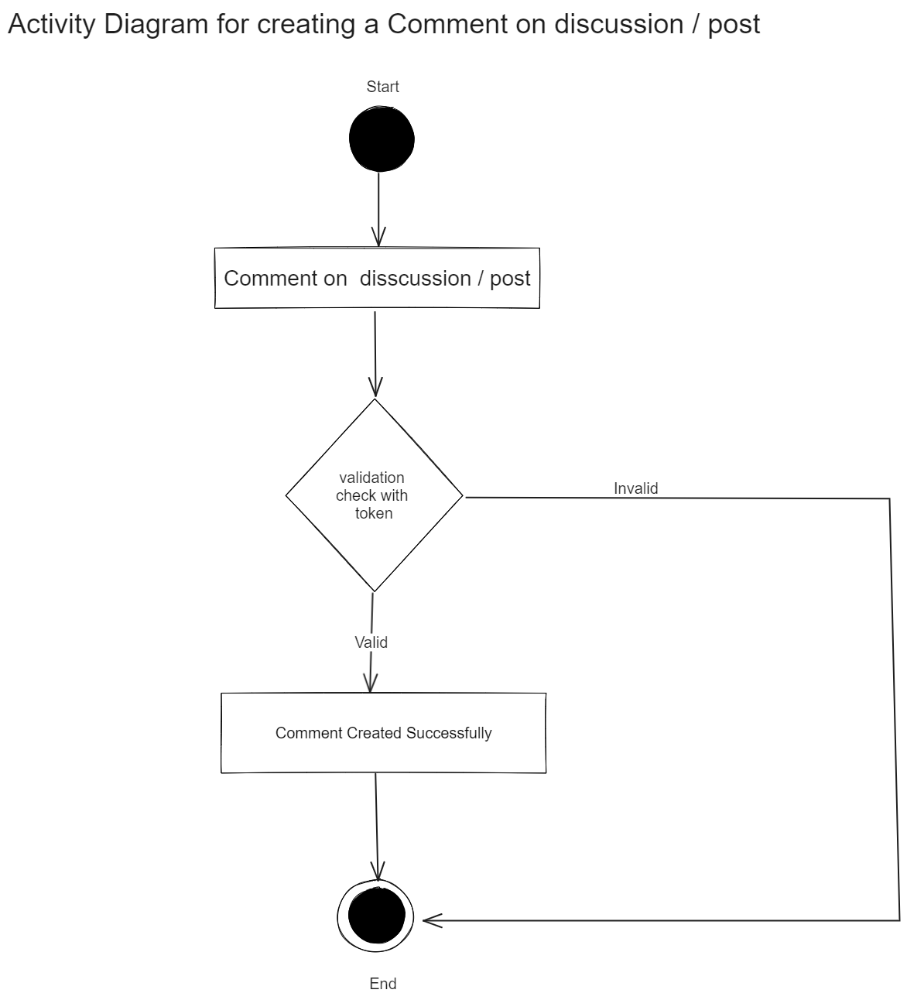
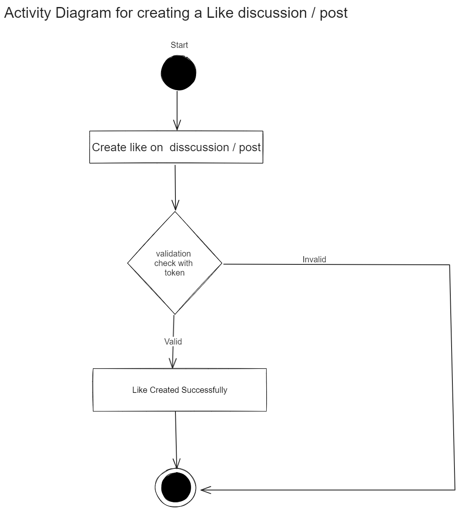
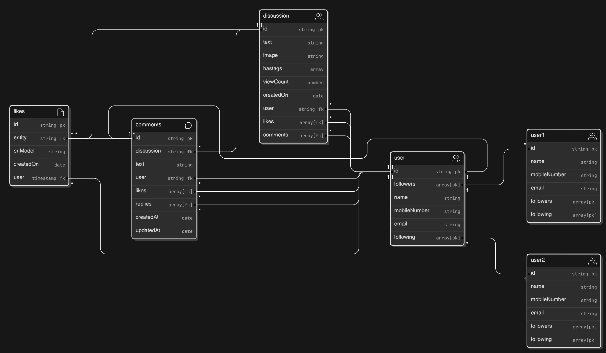

# Project Title

Spyne SDE-1 Backend-Role Assignment

## Description

In this project we are have made a kind of social media project , where a user can login/sign up , and do CRUD operation on Discusssion/Post, like, Comment.

## Important Note

**Note**: I am using a free server on Render, so there may be a cold start issue. All microservices may take more than 30 seconds to respond to the first request.


## Table of Contents

- [Installation](#installation)
- [Usage](#usage)
- [API Endpoints](#api-endpoints)
- [Microservices](#microservices)
- [Low Level Design (LLD)](#low-level-design-lld)
- [Database Schema](#database-schema)
- [Technologies Used](#technologies-used)

## Installation

Instructions on how to set up and run the project locally.

```bash
# Clone the repository
git clone https://github.com/Vikas62502/spyne-backend.git

# Navigate to the project directory
cd spyne-backend

# Install dependencies for the API Gateway
cd api-gateway
npm install
npm run dev

# Install dependencies for each microservice

cd ../user-service
npm install

cd ../discussion-service
npm install

cd ../comment-service
npm install

cd ../like-service
npm install

# Start the API Gateway
cd ../api-gateway
npm start

# Start each microservice in separate terminal tabs/windows

cd ../user-service
npm start

cd ../discussion-service
npm start

cd ../comment-service
npm start

cd ../like-service
npm start

```

## Usage

Now below i have provided the api endpoint you can hit using postman at

Public URL of postman
```bash
https://www.postman.com/lunar-capsule-120648/workspace/sypne-sde-i-assignment/collection/34837752-b5b5c2d4-3887-41a9-bb19-08627eafc003
```
```bash
https://app.getpostman.com/join-team?invite_code=81245a8c1d271c3b8c44c2b9c202f1ff&target_code=171e485612ea8a18c19cddc680bfd257
```

## API Endpoints

List of all API endpoints with brief descriptions.

### User Service

- **Create User**: `POST /users/signup`
- **Login User**: `POST /users/login`
- **Follow Other User**: `POST /users/followUser/:uidOfOtherUser`
- **Update User**: `PUT /users/updateUser/:uid`
- **Delete User**: `DELETE /users/deleteUser/:id`
- **Get All List of Users**: `GET /users/getAllUsers`
- **Search User by Name**: `GET /users/searchUserByName/:name`


### Discussion Service
- **Create Discussion**: `POST /discussions/createDiscussion`
- **Update Discussion**: `POST /discussions/updateDiscussion/:discussionId`
- **Delete Discussion**: `DELETE /discussions/deleteDiscussion/:discussionId`
- **Get Discussion By Tags**: `GET /discussions/getAllDiscussionsByTags?tags=%23:tagName`
- **Get Discussion By Text**: `GET /discussions//getAllDiscussionBasedOnText?text=:SearchText`
- **Get View Count**: `GET /discussions/getViewCount/:discussionId`

### Like Service
- **Create Like**: `POST /likes/createLike`
- **Delete Like**: `DELETE /likes/deleteLike/:LikeId`

### Comment Service
- **Create Comment**: `POST /comments/createComment`
- **Reply to** Comment: `POST /comments/replyComment`
- **Update Comment** : `POST /comments/updateComment/:CommentId`
- **Delete Discussion**: `DELETE /comments/deleteComment/:CommentId`

## Microservices

Here is the Microservice architecture diagram

<h3>Microservice Architecture</h3>


## Low Level Design (LLD)

Here is the Low level Use case Diagram

<h3>Use Case diagram</h3>


<h3>Activity diagram of Creating a Discussion</h3>


<h3>Activity diagram of Creating a comment</h3>


<h3>Activity diagram of Creating a like</h3>

## Database Schema

Here is the Data Model architecture Schema

<h3>Data Model architecture Schema</h3>


## Technologies Used

<p>Node.js</p>
<p>Express.js</p>
<p>MongoDB</p>
<p>JWT for authentication</p>
<p>fast-gateway</p>
